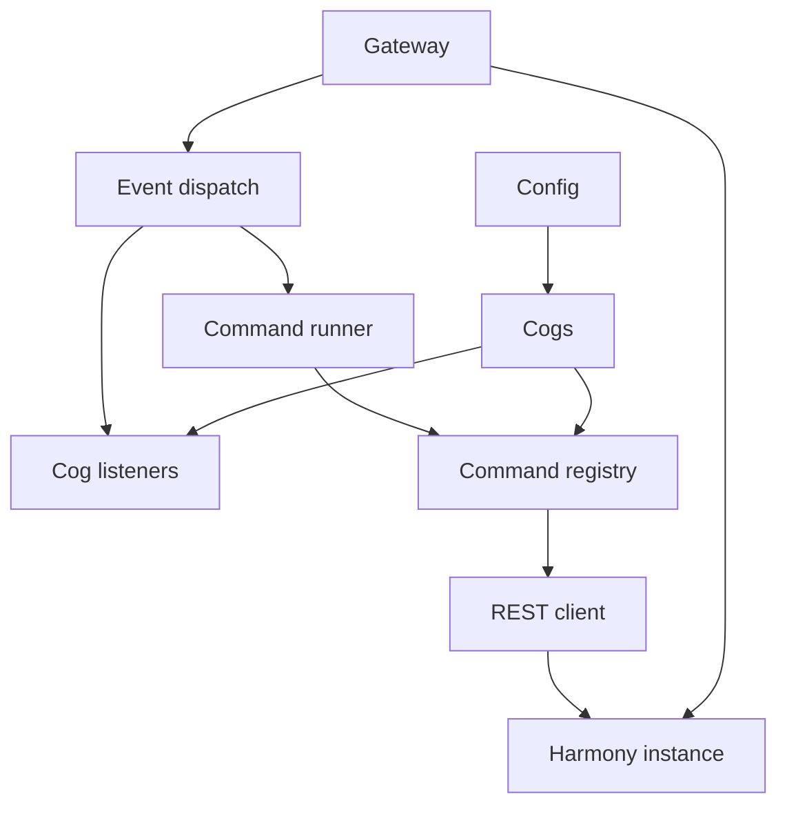

# harmonia-bot

A bot framework for [Harmony](https://github.com/YuukiEatsYou/harmony) — the self-hosted,
single-community chat server. It is to Harmony what [Redbot](https://github.com/CogCreators/Red-DiscordBot)
is to Discord: a **core** that speaks the whole server API, so you write modules
(cogs) against a friendly Python interface instead of re-implementing REST and
WebSocket plumbing for every bot.

```python
from harmonia import Cog, commands

class Ping(Cog):
    @commands.command(name="ping", description="Check that the bot is alive")
    async def ping(self, ctx: commands.Context) -> None:
        await ctx.send("Pong! 🏓")

async def setup(bot) -> None:
    await bot.add_cog(Ping(bot))
```

> **Status:** early. The core, command framework, config, cogs and the example
> modules are in place and tested; expect the API to move before a 1.0.

## What the core does for you

- **REST** — one `aiohttp` session, the token attached for you, transient
  failures (429 / 5xx) retried, and API errors turned into typed exceptions.
- **Gateway** — the WebSocket lifecycle: HELLO/IDENTIFY, heartbeat with a
  missing-ACK watchdog, and reconnect with jittered backoff.
- **Events** — `@bot.listen("message_create")` and `bot.wait_for(...)`.
- **Commands** — slash commands registered with the server, arguments parsed and
  converted from annotations (users, channels, roles, durations, flags, rest).
- **Config** — JSON-backed, scoped storage (`server`, `channel`, `member`,
  `role`, `user`), written atomically.
- **Cogs** — a `Cog` base class, load/unload/reload, and lifecycle hooks.

## Requirements

- Python 3.11 or newer.
- A Harmony instance and a bot account. Create one under **Admin → Bots** in the
  admin panel, grant it the permissions it needs, and copy its token — it is
  shown only once.

## Install

```sh
python -m venv .venv
. .venv/bin/activate
pip install -e .
```

## Configure and run

```sh
cp config.example.toml config.toml   # then edit it
python -m harmonia --config config.toml
```

`config.toml` holds the instance base URL, the bot token, the data directory and
the cogs to load. The token and base URL can also come from the environment
(`HARMONIA_TOKEN`, `HARMONIA_BASE_URL`) or the command line, for a service unit
that should not carry the token in a file. `config.toml` is gitignored.

The three bundled cogs are `/ping` (liveness), `/poll` (polls, flags and config)
and the moderation set (`/kick`, `/ban`, `/timeout`, `/whois`, ...). Remove them
from `extensions` when you write your own.

## Architecture

The layout mirrors Redbot: a `core` package plus loadable cogs.



A `Bot` owns all of it. A launcher constructs the bot, loads extensions and
calls `run`; every cog reaches back through `self.bot`.

## Writing a cog

A cog is a class subclassing `Cog`. Methods decorated with
`@commands.command` become slash commands; the first parameter is always the
context.

```python
from harmonia import Cog, commands
from harmonia.models import Member
from harmonia.permissions import Permissions

class Moderation(Cog):
    @commands.command(
        name="kick",
        description="Kick a member",
        required_permissions=Permissions.KICK_MEMBERS,   # enforced by the server
    )
    async def kick(self, ctx: commands.Context, member: Member, *, reason: str = "") -> None:
        await self.bot.http.kick_member(member.id)
        await ctx.send(f"Kicked {member.user.username}." + (f" Reason: {reason}" if reason else ""))

async def setup(bot) -> None:
    await bot.add_cog(Moderation(bot))
```

List it in `config.toml`:

```toml
extensions = ["cogs.moderation"]
```

`setup(bot)` may be sync or async; a module with no `setup` is searched for a
`Cog` subclass and loaded automatically.

## Commands

A command's parameters are bound from the raw argument string the server
forwards. The binding rules:

| Declaration | Meaning | Example |
| --- | --- | --- |
| `a: str` / `n: int` / `x: float` | one token, converted | `/add 2 3` |
| `member: Member` | one token, looked up (id or name) | `/kick bob` |
| `channel: Channel`, `role: Role`, `user: User` | looked up similarly | `/say #general hello` |
| `*options: str` | the remaining tokens | `/poll "Q" "A" "B"` |
| `*, text: str` | the whole remainder as one string | `/say hello there world` |
| `*, reason: str = ""` | a `--reason=value` option | `/kick bob --reason="spam"` |
| `*, multiple: bool = False` | a `--multiple` flag | `/poll "Q" A B --multiple` |
| `when: timedelta` | a duration like `30s`, `10m`, `2h`, `1d` | `/remind 10m` |

Quote a token to include spaces (`"deep dish"`). A failed conversion is
reported back to the channel, not raised into the gateway loop.

Raise a `harmonia.errors.BadArgument` (or any `CommandError`) to send a friendly
message instead of running:

```python
from harmonia.errors import BadArgument
if len(options) < 2:
    raise BadArgument("give at least two options")
```

A failed command (any `CommandError`) is answered with `⚠️ <message>`; an
unexpected exception is logged and answered with a generic message.

### Checks and permissions

`required_permissions` is sent to the server, which refuses the invocation
before it reaches the bot — the first line of access control. For the bot's own
conditions use a check:

```python
from harmonia.commands import checks
from harmonia.permissions import Permissions

@commands.command(name="cleanup", checks=[checks.has_permissions(Permissions.MANAGE_MESSAGES)])
async def cleanup(self, ctx): ...
```

## Events

Register a listener with `bot.listen(name)`; the payload is converted to a model
where one exists. `ready` fires after **every** (re)connection.

```python
class MyCog(Cog):
    async def cog_load(self) -> None:
        self.bot.listen("message_create")(self.on_message)

    async def on_message(self, message) -> None:
        ...
```

Event names are the gateway's, lowercased: `ready`, `message_create`,
`message_update`, `message_delete`, `message_reaction_add`,
`message_reaction_remove`, `message_reactions_clear`, `poll_update`,
`typing_start`, `presence_update`, `channel_create`/`_update`/`_delete`,
`category_create`/`_update`/`_delete`, `role_create`/`_update`/`_delete`,
`member_update`, `emoji_create`/`_delete`, `saved_message_update`,
`scheduled_message_update`, `event_update`, `event_reminder`,
`channel_settings_update`, `server_gifs_update`, `retention_applied`. Use `"*"`
for every event. See [the API reference](harmony/docs/API.md) for payloads.

> Note: Harmony's gateway has **no resume/replay**, so a reconnect is a fresh
> `READY` and events during the gap are lost. Treat `ready` as "refetch what I
> care about".

## Config

Each cog gets a namespaced view of one JSON file:

```python
def __init__(self, bot):
    super().__init__(bot)
    self.config = bot.config.cog("poll")
    self.config.register(duration_hours=24)   # defaults

async def something(self):
    await self.config.server().set("duration_hours", 48)
    hours = await self.config.server().get("duration_hours", 24)
    await self.config.channel(ctx.channel_id).set("last_poll", message.id)
```

Scopes are `.server()`, `.channel(id)`, `.member(id)`, `.role(id)`, `.user(id)`.
Values live in `data/config/<name>.json`, written with an atomic rename.

## Project layout

```
harmonia/            the framework package
  client.py          Bot: REST + gateway + dispatch + commands + cogs
  http.py            REST transport and typed endpoints
  gateway.py         WebSocket lifecycle and reconnect
  models.py          typed API objects
  permissions.py     the permission bitfield
  errors.py          exception hierarchy
  config.py          scoped JSON config
  commands/          command objects, argument parser, converters, checks
  cog.py             the Cog base class
cogs/                example cogs (ping, poll, moderation)
config.example.toml  copy to config.toml and edit
tests/               unit tests (pytest)
```

## Development

```sh
pip install -e ".[dev]"
pytest
ruff check harmonia cogs tests
```

## Notes

- The `harmony/` directory is a local checkout of the server source, kept for
  reference (the API docs and protocol types). It is gitignored and never pushed
  from this repository.
- The framework talks only to the documented HTTP and WebSocket API, so it works
  against any Harmony instance and does not depend on the server's internals.

## License

AGPL-3.0-or-later, matching Harmony.
